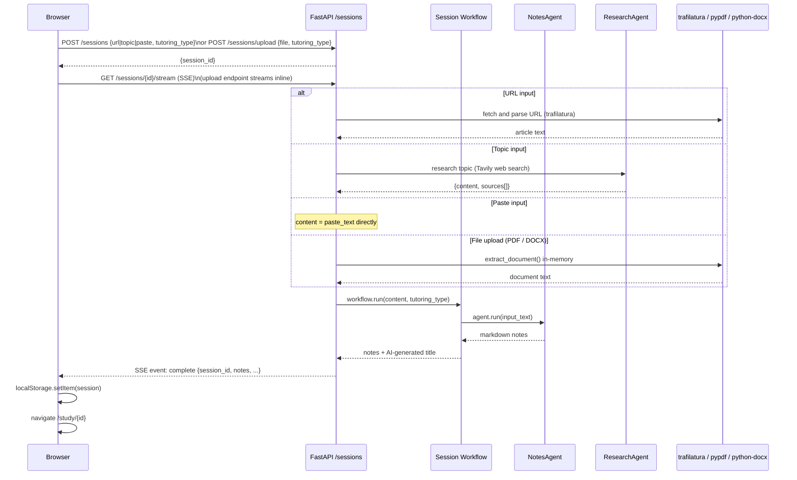

# Super Tutor

**AI-powered study companion** — turn any article URL, pasted text, uploaded document (PDF/DOCX), or topic description into structured study notes, interactive flashcards, a quiz, and a grounded chat tutor — all tailored to your learning style.

Super Tutor is a full-stack agentic application built on [Agno](https://app.agno.com). You feed it any source of knowledge and it spins up a complete study session: persona-adapted notes, on-demand flashcards and quizzes, and a session-scoped chat agent that answers questions strictly from the material — no hallucinated outside knowledge. Conversation history is persisted to SQLite so the chat tutor remembers earlier questions across browser refreshes.

#### Links :
- Frontend : https://super-tutor.vercel.app/
- Backend : https://super-tutor.onrender.com

---

## What It Does

1. You provide a **URL**, **pasted text**, **PDF/DOCX file**, or a **topic to research**
2. The backend extracts content (fetches the URL, reads the document, or researches the topic via Tavily web search)
3. A **Notes Agent** produces comprehensive, persona-adapted study notes
4. On demand, a **Flashcard Agent** and **Quiz Agent** generate interactive study materials
5. A **Chat Agent** lets you ask questions about the session — grounded strictly in the session material, with full conversation memory persisted across refreshes

---

## Architecture Overview

```
┌─────────────────────────────────────────────────────────┐
│                     Browser (Next.js)                    │
│  /create → POST /sessions (or /sessions/upload)          │
│         → /loading (SSE) → /study/id                     │
└───────────────────────────┬─────────────────────────────┘
                            │ HTTP / SSE
┌───────────────────────────▼─────────────────────────────┐
│              FastAPI Backend (Agno + AgentOS)             │
│                                                          │
│  ┌──────────────┐  ┌──────────────┐  ┌───────────────┐  │
│  │ /sessions    │  │ /sessions    │  │ /chat/stream  │  │
│  │ router       │  │ /upload      │  │ router        │  │
│  └──────┬───────┘  └──────┬───────┘  └──────┬────────┘  │
│         │                 │                  │            │
│  ┌──────▼─────────────────▼──────────────────▼────────┐  │
│  │           5 Agno Agents (per-request)               │  │
│  │  NotesAgent · ChatAgent · FlashcardAgent            │  │
│  │  QuizAgent  · ResearchAgent                         │  │
│  └─────────────────────────────────────────────────────┘  │
│         │                                                │
│  ┌──────▼──────────────────────┐                        │
│  │  AI Provider (configurable) │                        │
│  │  OpenAI / Anthropic /        │                        │
│  │  Groq / OpenRouter           │                        │
│  └──────────────────────────────┘                        │
│                                                          │
│  ┌──────────────────────────────────────────────────┐    │
│  │  AgentOS (app.agno.com)                          │    │
│  │  SQLite traces · Workflow session state          │    │
│  └──────────────────────────────────────────────────┘    │
└─────────────────────────────────────────────────────────┘
```

---

## Full Session Flow



---

## Tutoring Modes (Personas)

| Mode | Description | Best For |
|------|-------------|----------|
| **Micro Learning** | Short bullets, bold key terms, ultra-concise | Quick review, time-limited study |
| **Teaching a Kid** | Plain language, everyday analogies, no jargon | First-time learners, building intuition |
| **Advanced** | Graduate-level depth, precise terminology, caveats | Deep technical study, expert review |

---

## On-Demand Content Generation

After a session is created, flashcards and quizzes are generated on demand:

```
POST /sessions/{id}/regenerate/flashcards
POST /sessions/{id}/regenerate/quiz
```

Both use the stored source content + tutoring type loaded from SQLite to produce persona-adapted content.

---

## In-Session Chat Agent

The **ChatAgent** is a persistent tutoring assistant scoped to a single study session.

```
POST /chat/stream   → Server-Sent Events stream of the assistant reply
```

Key properties:

| Property | Behaviour |
|----------|-----------|
| **Grounded** | Answers only from the session's generated notes; refuses out-of-scope questions |
| **Persona-adapted** | Inherits the same tutoring mode (Micro / Kid / Advanced) as the rest of the session |
| **Server-side notes** | Notes are loaded from SQLite using `session_id` — the client does not re-send them |
| **Persistent memory** | Conversation history stored in SQLite via Agno and replayed by the agent on every request |
| **Resettable** | Client can send a `chat_reset_id` to start a fresh conversation while keeping the session data intact |
| **Stateless construction** | A fresh agent object is built per request; the DB provides continuity, so no server-side session state is needed |
| **Guardrailed** | Same prompt-injection pre-hook and substantive-output post-hook as all other agents |

---

## Security: Guardrails

Every agent has two guardrails applied via Agno hooks:

| Hook | Type | What It Does |
|------|------|-------------|
| `PromptInjectionGuardrail` | pre-hook | Blocks injection attempts before the LLM sees input |
| `validate_substantive_output` | post-hook | Rejects empty or suspiciously short responses |

---

## Observability

The FastAPI app is wrapped with **AgentOS** at startup:

- All five agents are registered for visibility in the [AgentOS playground UI](https://app.agno.com)
- Agent run traces are written to SQLite (`TRACE_DB_PATH`) via the `db=` parameter injected at call time
- Session lifecycle state (pending / complete / failed) is stored in a separate SQLite file (`SESSION_DB_PATH`)

---

## Monorepo Structure

```
super_tutor/
├── backend/            # FastAPI + Agno Python backend
│   ├── app/
│   │   ├── agents/     # 5 AI agents + guardrails + personas + model_factory
│   │   ├── workflows/  # Session workflow (notes pipeline)
│   │   ├── routers/    # /sessions, /sessions/upload, and /chat endpoints
│   │   ├── extraction/ # URL extraction (trafilatura), document extraction (pypdf/docx), text cleaner
│   │   ├── models/     # Pydantic request/response models
│   │   ├── utils/      # Session status store + logging helpers
│   │   └── config.py   # Settings (env-driven)
│   ├── tests/
│   └── requirements.txt
│
├── frontend/           # Next.js 14 + TypeScript + Tailwind CSS
│   └── src/
│       ├── app/
│       │   ├── page.tsx                    # Landing page
│       │   ├── create/page.tsx             # Session creation form (URL / topic / paste / upload)
│       │   ├── loading/page.tsx            # SSE progress screen
│       │   └── study/[sessionId]/page.tsx  # Study session view
│       ├── types/session.ts                # Shared TypeScript types
│       └── hooks/useRecentSessions.ts      # Recent sessions hook
│
├── docker-compose.yml  # Local full-stack dev environment
└── README.md
```

---

## Quick Start

### Prerequisites
- Python 3.11+
- Node.js 18+
- API key for your chosen AI provider
- *(Optional)* Tavily API key for topic-based research sessions

### Option A — Docker Compose

```bash
# Create backend/.env first (see environment variables below), then:
docker compose up
```

Frontend at `http://localhost:3000`, backend at `http://localhost:8000`.

### Option B — Manual

#### Backend

```bash
cd backend
python -m venv .venv && source .venv/bin/activate
pip install -r requirements.txt

cat > .env <<EOF
AGENT_PROVIDER=openai
AGENT_MODEL=gpt-4o
AGENT_API_KEY=sk-...
TAVILY_API_KEY=tvly-...
ALLOWED_ORIGINS=http://localhost:3000
EOF

uvicorn app.main:app --reload --port 8000
```

#### Frontend

```bash
cd frontend
npm install
echo "NEXT_PUBLIC_API_URL=http://localhost:8000" > .env.local
npm run dev
```

Open `http://localhost:3000`.

---

## Supported AI Providers

| Provider | `AGENT_PROVIDER` | Example `AGENT_MODEL` |
|----------|------------------|-----------------------|
| OpenAI | `openai` | `gpt-4o` |
| Anthropic | `anthropic` | `claude-3-5-sonnet-20241022` |
| Groq | `groq` | `llama-3.3-70b-versatile` |
| OpenRouter | `openrouter` | `openai/gpt-4o` |

---

## Environment Variables

| Variable | Default | Description |
|----------|---------|-------------|
| `AGENT_PROVIDER` | `openai` | AI provider (`openai` / `anthropic` / `groq` / `openrouter`) |
| `AGENT_MODEL` | `gpt-4o` | Model ID for the chosen provider |
| `AGENT_API_KEY` | *(required)* | API key for the provider |
| `AGENT_FALLBACK_PROVIDER` | `""` | Optional fallback provider on retry |
| `AGENT_FALLBACK_MODEL` | `""` | Optional fallback model ID on retry |
| `AGENT_FALLBACK_API_KEY` | `""` | API key for fallback provider (defaults to `AGENT_API_KEY`) |
| `AGENT_MAX_RETRIES` | `3` | Max retry attempts per agent call |
| `TRACE_DB_PATH` | `tmp/super_tutor_traces.db` | SQLite path for AgentOS traces + workflow session state |
| `SESSION_DB_PATH` | `tmp/super_tutor_sessions.db` | SQLite path for session lifecycle status |
| `ALLOWED_ORIGINS` | `http://localhost:3000` | CORS origins (comma-separated or JSON array) |
| `TAVILY_API_KEY` | *(optional)* | Required for topic-mode research sessions |

---

## Further Reading

- [Backend README](./backend/README.md) — agents, workflows, API reference, observability
- [Frontend README](./frontend/README.md) — pages, data flow, localStorage, SSE handling
