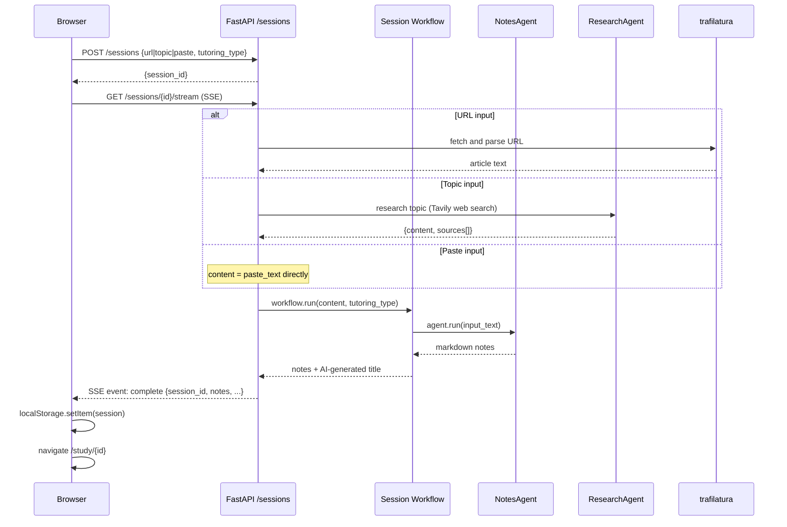

# Super Tutor

**AI-powered study companion** — turn any article URL, pasted text, or topic description into structured study notes, interactive flashcards, and a quiz, tailored to your learning style.

---

## What It Does

1. You provide a **URL**, **pasted text**, or a **topic to research**
2. The backend extracts content (or researches the topic via web search)
3. An AI notes agent produces comprehensive study notes
4. On demand, flashcard and quiz agents generate interactive study materials
5. A grounded chat agent lets you ask questions about the session content

---

## Architecture Overview

```
┌─────────────────────────────────────────────────────────┐
│                     Browser (Next.js)                    │
│  /create → POST /sessions → /loading (SSE) → /study/id  │
└───────────────────────────┬─────────────────────────────┘
                            │ HTTP / SSE
┌───────────────────────────▼─────────────────────────────┐
│                   FastAPI Backend (Agno)                  │
│                                                          │
│  ┌──────────────┐    ┌──────────────┐                   │
│  │ /sessions    │    │ /chat/stream │                   │
│  │ router       │    │ router       │                   │
│  └──────┬───────┘    └──────┬───────┘                   │
│         │                   │                            │
│  ┌──────▼───────────────────▼──────────────────────┐    │
│  │           5 Agno Agents (per-request)            │    │
│  │  NotesAgent · ChatAgent · FlashcardAgent         │    │
│  │  QuizAgent  · ResearchAgent                      │    │
│  └──────────────────────────────────────────────────┘    │
│         │                                                │
│  ┌──────▼──────────────────────┐                        │
│  │  AI Provider (configurable) │                        │
│  │  OpenAI / Anthropic /        │                        │
│  │  Groq / OpenRouter           │                        │
│  └──────────────────────────────┘                        │
└─────────────────────────────────────────────────────────┘
```

---

## Full Session Flow



---

## Tutoring Modes (Personas)

| Mode | Description | Best For |
|------|-------------|----------|
| **Micro Learning** | Short bullets, bold key terms, ultra-concise | Quick review, time-limited study |
| **Teaching a Kid** | Plain language, everyday analogies, no jargon | First-time learners, building intuition |
| **Advanced** | Graduate-level depth, precise terminology, caveats | Deep technical study, expert review |

---

## On-Demand Content Generation

After a session is created, flashcards and quizzes are generated on demand:

```
POST /sessions/{id}/regenerate/flashcards
POST /sessions/{id}/regenerate/quiz
```

Both use the stored notes + tutoring type to produce persona-adapted content.

---

## Security: Guardrails

Every agent has two guardrails applied via Agno hooks:

| Hook | Type | What It Does |
|------|------|-------------|
| `PromptInjectionGuardrail` | pre-hook | Blocks injection attempts before the LLM sees input |
| `validate_substantive_output` | post-hook | Rejects empty or suspiciously short responses |

---

## Monorepo Structure

```
super_tutor/
├── backend/            # FastAPI + Agno Python backend
│   ├── app/
│   │   ├── agents/     # 5 AI agents + guardrails + personas + model_factory
│   │   ├── workflows/  # Session workflow (notes pipeline)
│   │   ├── routers/    # /sessions and /chat endpoints
│   │   ├── extraction/ # Content extraction (trafilatura)
│   │   ├── models/     # Pydantic request/response models
│   │   ├── utils/      # Session status store + logging helpers
│   │   └── config.py   # Settings (env-driven)
│   └── requirements.txt
│
├── frontend/           # Next.js 14 + TypeScript + Tailwind CSS
│   └── src/
│       ├── app/
│       │   ├── page.tsx                    # Landing page
│       │   ├── create/page.tsx             # Session creation form
│       │   ├── loading/page.tsx            # SSE progress screen
│       │   └── study/[sessionId]/page.tsx  # Study session view
│       ├── types/session.ts                # Shared TypeScript types
│       └── app/hooks/useRecentSessions.ts  # Recent sessions hook
│
└── README.md
```

---

## Quick Start

### Prerequisites
- Python 3.11+
- Node.js 18+
- API key for your chosen AI provider
- *(Optional)* Tavily API key for topic-based research sessions

### Backend

```bash
cd backend
python -m venv .venv && source .venv/bin/activate
pip install -r requirements.txt

cat > .env <<EOF
AGENT_PROVIDER=openai
AGENT_MODEL=gpt-4o
AGENT_API_KEY=sk-...
TAVILY_API_KEY=tvly-...
ALLOWED_ORIGINS=http://localhost:3000
EOF

uvicorn app.main:app --reload --port 8000
```

### Frontend

```bash
cd frontend
npm install
echo "NEXT_PUBLIC_API_URL=http://localhost:8000" > .env.local
npm run dev
```

Open `http://localhost:3000`.

---

## Supported AI Providers

| Provider | `AGENT_PROVIDER` | Example `AGENT_MODEL` |
|----------|------------------|-----------------------|
| OpenAI | `openai` | `gpt-4o` |
| Anthropic | `anthropic` | `claude-3-5-sonnet-20241022` |
| Groq | `groq` | `llama-3.3-70b-versatile` |
| OpenRouter | `openrouter` | `openai/gpt-4o` |

---

## Further Reading

- [Backend README](./backend/README.md) — agents, workflows, API reference, observability
- [Frontend README](./frontend/README.md) — pages, data flow, localStorage, SSE handling
