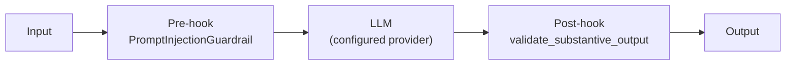
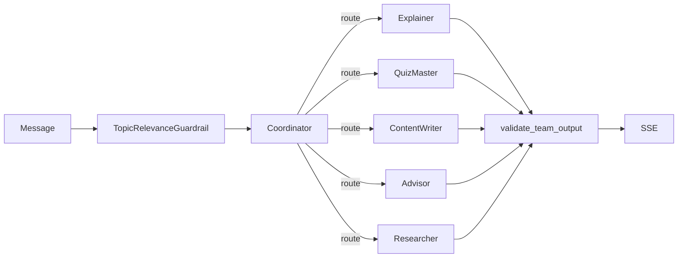
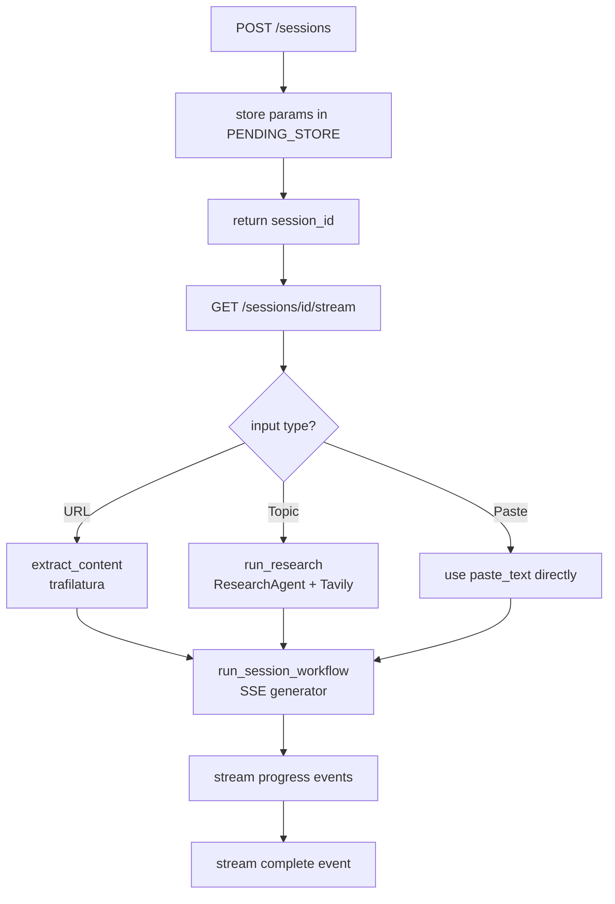
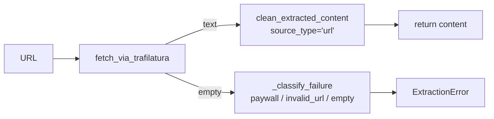
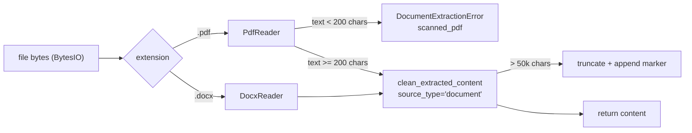

# Super Tutor — Backend

FastAPI + [Agno](https://docs.agno.com) backend that powers the Super Tutor study session pipeline. Provides SSE-streaming endpoints for session creation, file upload, chat, and a Personal Tutor, backed by five AI agents, an Agno Team, a workflow engine, and SQLite-based tracing.

---

## Tech Stack

| Layer | Technology |
|-------|-----------|
| API framework | FastAPI + uvicorn |
| AI agent framework | Agno >= 2.5.7 |
| Content extraction (URL) | trafilatura |
| Content extraction (files) | pypdf + python-docx |
| Web research | Tavily (via `agno.tools.tavily`) |
| Session + trace storage | SQLite (via `agno.db.sqlite.SqliteDb`) |
| Observability UI | AgentOS (Agno control plane) |
| Settings | pydantic-settings (`.env` file) |
| Retry | tenacity |

---

## Directory Layout

```
backend/
├── app/
│   ├── main.py              # FastAPI app factory + AgentOS wrapper + rate limiter setup
│   ├── config.py            # Settings (env-driven via pydantic-settings)
│   ├── dependencies.py      # Shared DI: get_traces_db, limiter, ACTIVE_TASKS
│   ├── agents/
│   │   ├── notes_agent.py       # NotesAgent — comprehensive study notes
│   │   ├── chat_agent.py        # ChatAgent — grounded Q&A on session notes
│   │   ├── flashcard_agent.py   # FlashcardAgent — JSON flashcard generation
│   │   ├── quiz_agent.py        # QuizAgent — JSON multiple-choice quiz
│   │   ├── research_agent.py    # ResearchAgent — Tavily web search + synthesis
│   │   ├── tutor_team.py        # TutorTeam — 5-specialist Agno Team (route mode)
│   │   ├── guardrails.py        # Pre/post hooks: PromptInjection, TopicRelevance, validate_team_output
│   │   ├── model_factory.py     # Provider-agnostic model resolver
│   │   └── personas.py          # Persona strings for tutoring modes
│   ├── workflows/
│   │   └── session_workflow.py  # Agno Workflow + Step (notes pipeline + SSE)
│   ├── routers/
│   │   ├── sessions.py          # POST /sessions, GET /sessions/{id}, POST /sessions/{id}/regenerate/{section}
│   │   ├── upload.py            # POST /sessions/upload (PDF/DOCX file upload)
│   │   ├── chat.py              # POST /chat/stream (single-agent floating chat)
│   │   └── tutor.py             # POST /tutor/{session_id}/stream (TutorTeam SSE)
│   ├── extraction/
│   │   ├── chain.py                  # extract_content() orchestrator + ExtractionError
│   │   ├── trafilatura_extractor.py  # trafilatura fetch wrapper
│   │   ├── document_extractor.py     # PDF/DOCX in-memory text extraction
│   │   └── cleaner.py                # Text normalisation shared by all extractors
│   ├── models/
│   │   ├── session.py           # SessionRequest Pydantic model
│   │   ├── chat.py              # ChatStreamRequest Pydantic model
│   │   └── tutor.py             # TutorStreamRequest Pydantic model
│   └── utils/
│       ├── session_status.py    # In-process session status store (create/update/get)
│       └── logging.py           # Structured logging helpers
├── tests/
│   ├── test_sessions_router.py
│   ├── test_upload_router.py
│   ├── test_document_extractor.py
│   └── test_cleaner.py
└── requirements.txt
```

---

## Agents

### Architecture: All Agents

Every agent is built by a `build_*` factory function — a new instance is constructed per request, never reused. All agents share prompt-injection guardrails:



---

### NotesAgent

**File:** `app/agents/notes_agent.py`

Produces comprehensive markdown study notes from provided content.

- Persona-adapted (micro_learning / teaching_a_kid / advanced)
- Coverage rule: must capture every section, concept, and example
- Format: markdown headings, bold key terms, prose + bullets

---

### ChatAgent

**File:** `app/agents/chat_agent.py`

Stateless Q&A agent grounded strictly in session notes.

- Session notes are injected into the system prompt at construction time
- Notes are loaded server-side from SQLite using `session_id` — the client does not supply notes
- Refuses to use outside knowledge — responds only from session material
- Supports `chat_reset_id`: appended to the Agno session key so a reset starts a fresh conversation history in SQLite
- Supports streaming via `agent.arun(stream=True)`

---

### FlashcardAgent

**File:** `app/agents/flashcard_agent.py`

Generates 8–12 flashcards as a JSON array.

Output format:
```json
[
  {"front": "Question or term", "back": "Answer or definition"}
]
```

---

### QuizAgent

**File:** `app/agents/quiz_agent.py`

Generates 8–10 multiple-choice questions as a JSON array.

Output format:
```json
[
  {
    "question": "Question text",
    "options": ["A", "B", "C", "D"],
    "answer_index": 0
  }
]
```

---

### ResearchAgent

**File:** `app/agents/research_agent.py`

Researches a topic using Tavily web search and synthesizes findings into educational prose.

- Runs 2–3 targeted searches with different query angles
- Returns `{"content": "<600+ word prose>", "sources": ["url1", ...]}`
- Used for topic-mode session creation and as the **Researcher** specialist inside TutorTeam

---

### TutorTeam

**File:** `app/agents/tutor_team.py`

A 5-member Agno Team operating in `TeamMode.route`. The coordinator silently delegates each message to exactly one specialist — no synthesis or coordinator commentary is added.



| Specialist | When dispatched |
|------------|----------------|
| **Explainer** | Questions about session material, greetings, clarification requests |
| **QuizMaster** | "Quiz me", MCQ answers, quiz tab score sharing |
| **ContentWriter** | Flashcard/notes/quiz generation requests in chat |
| **Advisor** | Progress questions ("how am I doing?", "what should I focus on?") |
| **Researcher** | Requests to go deeper or find external information |

**Key design decisions:**
- `session_state` seeded with `source_content` + `notes` at construction; `add_session_state_to_context=True` injects a `<session_state>` block into every specialist's system message
- Conversation history lives at the Team level only — member agents have no `db=` parameter to avoid duplicate SQLite rows
- Team session namespace: `tutor:{session_id}:{tutor_reset_id}` — separate from workflow session rows

---

## Workflow: Session Workflow

**File:** `app/workflows/session_workflow.py`

An Agno `Workflow` with a single `Step` (`notes_step`). The step executor is synchronous and runs via `asyncio.to_thread` to preserve the async SSE stream.

```mermaid
flowchart TD
    A[run_session_workflow called] --> B[yield: Crafting your notes...]
    B --> C[build_session_workflow\nper-request Workflow instance]
    C --> D["asyncio.to_thread\nworkflow.run()"]
    D --> E[notes_step executor]
    E --> F[build_notes_agent]
    F --> G[agent.run]
    G --> H{notes length\n>= 100 chars?}
    H -- No --> I[raise RuntimeError]
    H -- Yes --> J[write to session_state\nAgno persists to SQLite]
    J --> K[asyncio.to_thread\n_generate_title]
    K --> L[yield: workflow_completed\n{notes, title, sources, ...}]
```

**Session state** is persisted to SQLite by Agno's `save_session()` in the finally block — this is automatic when `session_state` is mutated inside the step executor. Both `notes` and `source_content` are stored, so regenerate endpoints can reload them without requiring the client to re-send the original material.

---

## Routers

### Sessions Router — `app/routers/sessions.py`

| Method | Path | Description |
|--------|------|-------------|
| `POST` | `/sessions` | Creates a pending session, kicks off background pipeline, returns `{session_id}` |
| `GET` | `/sessions/{id}` | Polls session status; returns full session data when complete |
| `POST` | `/sessions/{id}/regenerate/{section}` | Generates flashcards or quiz on demand; loads source content from SQLite |

`_guard_session()` checks that the session exists and is complete before proceeding. Returns HTTP 404 for unknown/expired session IDs and HTTP 409 if the session is still processing.

#### SSE Stream Events

| Event | Payload | Description |
|-------|---------|-------------|
| `progress` | `{message: string}` | Step-by-step status update |
| `warning` | `{message: string}` | Non-fatal warning (e.g. limited research content) |
| `complete` | Full `SessionResult` | Pipeline finished — contains notes + metadata |
| `error` | `{kind, message}` | Failure (paywall, invalid_url, empty, unreachable) |

#### Session Creation Flow



---

### Upload Router — `app/routers/upload.py`

| Method | Path | Description |
|--------|------|-------------|
| `POST` | `/sessions/upload` | Accepts a PDF or DOCX file via multipart/form-data; validates, extracts text, then streams session-creation progress via SSE |

**Pre-stream validation** (errors return plain HTTP, not SSE):

| Check | Error |
|-------|-------|
| Extension not `.pdf` or `.docx` | HTTP 400 |
| File size > 20 MB | HTTP 413 |
| Scanned/image-only PDF (no extractable text) | HTTP 422 with `error_kind: scanned_pdf` |

After validation passes, the router streams the same SSE events as the sessions router (`progress`, `complete`, `error`).

---

### Chat Router — `app/routers/chat.py`

| Method | Path | Description |
|--------|------|-------------|
| `POST` | `/chat/stream` | SSE token stream for a single chat turn (floating panel) |

- Accepts `{message, tutoring_type, session_id, chat_reset_id?}`
- **Notes are loaded server-side from SQLite** using `session_id` — the client does not send notes
- Builds a new `ChatAgent` per request with notes injected into the system prompt
- `chat_reset_id`: optional field; when provided, appended to the Agno session key so the agent starts a fresh conversation history
- Streams tokens as `event: token` SSE events; terminates with `event: done`

---

### Tutor Router — `app/routers/tutor.py`

| Method | Path | Description |
|--------|------|-------------|
| `POST` | `/tutor/{session_id}/stream` | SSE token stream from the 5-specialist TutorTeam |

- Accepts `{message, tutoring_type, session_id, tutor_reset_id}`
- **`source_content` and `notes` are loaded from SQLite** using `session_id` (the same workflow session row written at session creation)
- Builds a `TutorTeam` per request; session namespace: `tutor:{session_id}:{tutor_reset_id}`
- Rate-limited at `RATE_LIMIT_TUTOR` (default 60/minute per IP) via `slowapi`
- Handles fallback model automatically on provider rate-limit errors

#### SSE Events

| Event | Payload | Description |
|-------|---------|-------------|
| `stream_start` | `{}` | Stream opened |
| `token` | `{token: string}` | Content token from the active specialist |
| `done` | `{}` | Specialist response complete |
| `rejected` | `{reason: string}` | Off-topic message blocked by `TopicRelevanceGuardrail` |
| `error` | `{error: string}` | Unrecoverable error (both primary and fallback failed) |

---

## Content Extraction

### URL Extraction — `app/extraction/chain.py`



Paywall domains are classified specifically (`nytimes.com`, `wsj.com`, `ft.com`, `bloomberg.com`, `economist.com`) so the frontend can show targeted guidance.

### Document Extraction — `app/extraction/document_extractor.py`

In-memory extraction (never writes to disk) for PDF and DOCX files.



### Text Cleaner — `app/extraction/cleaner.py`

Shared normalisation step applied after both URL and document extraction:

- Normalises Unicode, collapses whitespace, strips control characters
- `source_type='document'`: also strips residual HTML tags (common in pypdf output)
- `source_type='url'`: preserves trafilatura markdown markup

---

## Guardrails

**File:** `app/agents/guardrails.py`

| Guardrail | Scope | Hook Type | Behaviour |
|-----------|-------|-----------|-----------|
| `PromptInjectionGuardrail` | All agents | pre-hook | Raises `InputCheckError` if injection patterns detected |
| `validate_substantive_output` | All agents | post-hook | Raises `OutputCheckError` if response is < 20 characters |
| `TopicRelevanceGuardrail` | TutorTeam | pre-hook (Team) | Uses an LLM judge to reject messages unrelated to the session topic; emits `TeamRunError` which the router converts to a `rejected` SSE event |
| `validate_team_output` | TutorTeam | post-hook (Team) | Raises `OutputCheckError` if the full Team response is empty or < 20 characters |

---

## Model Factory

**File:** `app/agents/model_factory.py`

Resolves the configured provider to an Agno model object at runtime. Supports an optional fallback model (`AGENT_FALLBACK_MODEL`) for retry on provider errors.

---

## Personas

**File:** `app/agents/personas.py`

Three persona strings injected as the first line of every agent's system prompt:

| Key | Tone |
|-----|------|
| `micro_learning` | Concise, bullet-driven, under 2 sentences per point |
| `teaching_a_kid` | Simple words, everyday analogies, encouraging |
| `advanced` | Graduate-level, precise terminology, nuance and caveats |

---

## Configuration

All settings are read from `.env` via `pydantic-settings`:

| Variable | Default | Description |
|----------|---------|-------------|
| `AGENT_PROVIDER` | `openai` | `openai` / `anthropic` / `groq` / `openrouter` |
| `AGENT_MODEL` | `gpt-4o` | Model ID for the chosen provider |
| `AGENT_API_KEY` | *(required)* | API key for the provider |
| `AGENT_FALLBACK_PROVIDER` | `""` | Optional fallback provider on rate-limit retry |
| `AGENT_FALLBACK_MODEL` | `""` | Optional fallback model ID on retry |
| `AGENT_FALLBACK_API_KEY` | `""` | API key for fallback provider (defaults to `AGENT_API_KEY`) |
| `AGENT_MAX_RETRIES` | `3` | Max retry attempts per agent call |
| `TRACE_DB_PATH` | `tmp/super_tutor_traces.db` | SQLite path for agent traces + workflow session state |
| `SESSION_DB_PATH` | `tmp/super_tutor_sessions.db` | SQLite path for session lifecycle status |
| `ALLOWED_ORIGINS` | `http://localhost:3000` | CORS origins (comma-separated or JSON array) |
| `TAVILY_API_KEY` | *(optional)* | Required for topic-mode research and TutorTeam Researcher specialist |
| `TUTOR_HISTORY_WINDOW` | `10` | Past Team runs included in tutor conversation context |
| `AGNO_TELEMETRY` | *(unset)* | Set to `false` to disable Agno telemetry |

---

## Observability

The app is wrapped with `AgentOS` at startup (`_wrap_with_agentos` in `main.py`):

- All five agents are registered for visibility in the **AgentOS playground UI** at `https://app.agno.com`
- Agent run traces are written to SQLite (`TRACE_DB_PATH`) via the `db=` parameter injected at call time
- Session workflow state is persisted separately to `SESSION_DB_PATH`

---

## Running Locally

```bash
cd backend
python -m venv .venv && source .venv/bin/activate
pip install -r requirements.txt

# Minimum .env
cat > .env <<EOF
AGENT_PROVIDER=openai
AGENT_MODEL=gpt-4o
AGENT_API_KEY=sk-...
TAVILY_API_KEY=tvly-...
EOF

uvicorn app.main:app --reload --port 8000
```

API docs available at `http://localhost:8000/docs`.

---

## Running Tests

```bash
cd backend
pytest tests/
```
