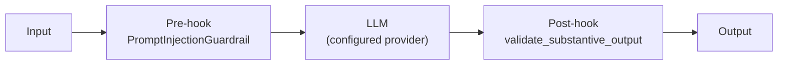
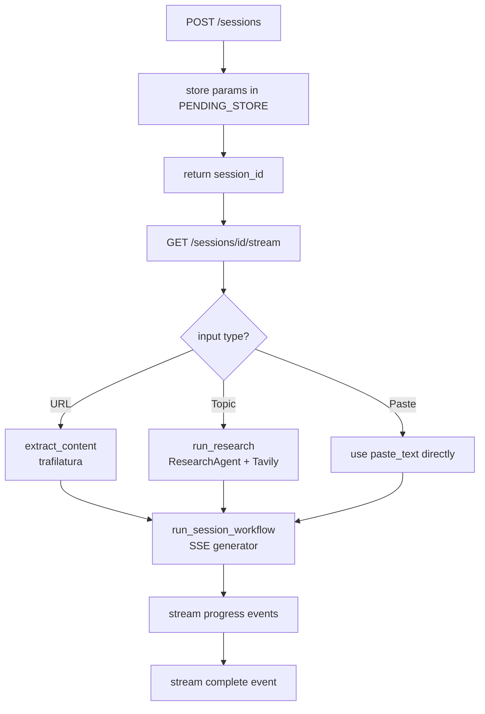
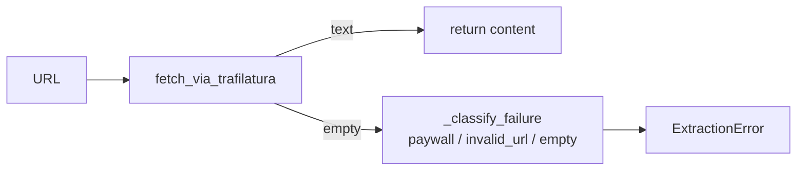

# Super Tutor — Backend

FastAPI + [Agno](https://docs.agno.com) backend that powers the Super Tutor study session pipeline. Provides SSE-streaming endpoints for session creation and real-time chat, backed by five AI agents, a workflow engine, and SQLite-based tracing.

---

## Tech Stack

| Layer | Technology |
|-------|-----------|
| API framework | FastAPI + uvicorn |
| AI agent framework | Agno >= 2.5.7 |
| Content extraction | trafilatura |
| Web research | Tavily (via `agno.tools.tavily`) |
| Session + trace storage | SQLite (via `agno.db.sqlite.SqliteDb`) |
| Observability UI | AgentOS (Agno control plane) |
| Settings | pydantic-settings (`.env` file) |
| Retry | tenacity |

---

## Directory Layout

```
backend/
├── app/
│   ├── main.py              # FastAPI app factory + AgentOS wrapper
│   ├── config.py            # Settings (env-driven via pydantic-settings)
│   ├── agents/
│   │   ├── notes_agent.py       # NotesAgent — comprehensive study notes
│   │   ├── chat_agent.py        # ChatAgent — grounded Q&A on session notes
│   │   ├── flashcard_agent.py   # FlashcardAgent — JSON flashcard generation
│   │   ├── quiz_agent.py        # QuizAgent — JSON multiple-choice quiz
│   │   ├── research_agent.py    # ResearchAgent — Tavily web search + synthesis
│   │   ├── guardrails.py        # Shared pre/post hooks for all agents
│   │   ├── model_factory.py     # Provider-agnostic model resolver
│   │   └── personas.py          # Persona strings for tutoring modes
│   ├── workflows/
│   │   └── session_workflow.py  # Agno Workflow + Step (notes pipeline + SSE)
│   ├── routers/
│   │   ├── sessions.py          # POST /sessions, GET /sessions/{id}/stream, POST /sessions/{id}/regenerate/{section}
│   │   └── chat.py              # POST /chat/stream
│   ├── extraction/
│   │   ├── chain.py             # extract_content() orchestrator + ExtractionError
│   │   └── trafilatura_extractor.py  # trafilatura fetch wrapper
│   ├── models/
│   │   ├── session.py           # SessionRequest Pydantic model
│   │   └── chat.py              # ChatStreamRequest Pydantic model
│   └── utils/
│       ├── session_status.py    # In-process session status store (create/update/get)
│       └── logging.py           # Structured logging helpers
└── requirements.txt
```

---

## Agents

### Architecture: All Agents

Every agent is built by a `build_*` factory function — a new instance is constructed per request, never reused. All five agents share the same guardrails:



---

### NotesAgent

**File:** `app/agents/notes_agent.py`

Produces comprehensive markdown study notes from provided content.

- Persona-adapted (micro_learning / teaching_a_kid / advanced)
- Coverage rule: must capture every section, concept, and example
- Format: markdown headings, bold key terms, prose + bullets

---

### ChatAgent

**File:** `app/agents/chat_agent.py`

Stateless Q&A agent grounded strictly in session notes.

- Session notes are injected into the system prompt at construction time
- Refuses to use outside knowledge — responds only from session material
- History is passed as a `List[Message]` on every request (client-side 6-turn cap)
- Supports streaming via `agent.arun(stream=True)`

---

### FlashcardAgent

**File:** `app/agents/flashcard_agent.py`

Generates 8–12 flashcards as a JSON array.

Output format:
```json
[
  {"front": "Question or term", "back": "Answer or definition"}
]
```

---

### QuizAgent

**File:** `app/agents/quiz_agent.py`

Generates 8–10 multiple-choice questions as a JSON array.

Output format:
```json
[
  {
    "question": "Question text",
    "options": ["A", "B", "C", "D"],
    "answer_index": 0
  }
]
```

---

### ResearchAgent

**File:** `app/agents/research_agent.py`

Researches a topic using Tavily web search and synthesizes findings into educational prose.

- Runs 2–3 targeted searches with different query angles
- Returns `{"content": "<600+ word prose>", "sources": ["url1", ...]}`
- Used exclusively for topic-mode sessions

---

## Workflow: Session Workflow

**File:** `app/workflows/session_workflow.py`

An Agno `Workflow` with a single `Step` (`notes_step`). The step executor is synchronous and runs via `asyncio.to_thread` to preserve the async SSE stream.

```mermaid
flowchart TD
    A[run_session_workflow called] --> B[yield: Crafting your notes...]
    B --> C[build_session_workflow\nper-request Workflow instance]
    C --> D["asyncio.to_thread\nworkflow.run()"]
    D --> E[notes_step executor]
    E --> F[build_notes_agent]
    F --> G[agent.run]
    G --> H{notes length\n>= 100 chars?}
    H -- No --> I[raise RuntimeError]
    H -- Yes --> J[write to session_state\nAgno persists to SQLite]
    J --> K[asyncio.to_thread\n_generate_title]
    K --> L[yield: workflow_completed\n{notes, title, sources, ...}]
```

**Session state** is persisted to SQLite by Agno's `save_session()` in the finally block — this is automatic when `session_state` is mutated inside the step executor.

---

## Routers

### Sessions Router — `app/routers/sessions.py`

| Method | Path | Description |
|--------|------|-------------|
| `POST` | `/sessions` | Creates a pending session, kicks off background pipeline, returns `{session_id}` |
| `GET` | `/sessions/{id}` | Polls session status; returns full session data when complete |
| `POST` | `/sessions/{id}/regenerate/{section}` | Generates flashcards or quiz on demand (guarded by `_guard_session`) |

`_guard_session()` checks that the session exists and is complete before proceeding. Returns HTTP 404 for unknown/expired session IDs and HTTP 409 if the session is still processing.

#### SSE Stream Events

| Event | Payload | Description |
|-------|---------|-------------|
| `progress` | `{message: string}` | Step-by-step status update |
| `warning` | `{message: string}` | Non-fatal warning (e.g. limited research content) |
| `complete` | Full `SessionResult` | Pipeline finished — contains notes + metadata |
| `error` | `{kind, message}` | Failure (paywall, invalid_url, empty, unreachable) |

#### Session Creation Flow



---

### Chat Router — `app/routers/chat.py`

| Method | Path | Description |
|--------|------|-------------|
| `POST` | `/chat/stream` | SSE token stream for a single chat turn |

- Accepts `{message, notes, tutoring_type, history, session_id}`
- Builds a new `ChatAgent` per request with notes injected into the system prompt
- Streams tokens as `event: token` SSE events
- Terminates with `event: done`

---

## Content Extraction

**File:** `app/extraction/chain.py`



Paywall domains are classified specifically (`nytimes.com`, `wsj.com`, `ft.com`, `bloomberg.com`, `economist.com`) so the frontend can show targeted guidance.

---

## Guardrails

**File:** `app/agents/guardrails.py`

| Guardrail | Hook Type | Behaviour |
|-----------|-----------|-----------|
| `PromptInjectionGuardrail` | pre-hook | Raises `InputCheckError` if injection patterns detected; caught at router level and returned as user-friendly error |
| `validate_substantive_output` | post-hook | Raises `OutputCheckError` if response is < 20 characters |

---

## Model Factory

**File:** `app/agents/model_factory.py`

Resolves the configured provider to an Agno model object at runtime. Supports an optional fallback model (`AGENT_FALLBACK_MODEL`) for retry on provider errors.

---

## Personas

**File:** `app/agents/personas.py`

Three persona strings injected as the first line of every agent's system prompt:

| Key | Tone |
|-----|------|
| `micro_learning` | Concise, bullet-driven, under 2 sentences per point |
| `teaching_a_kid` | Simple words, everyday analogies, encouraging |
| `advanced` | Graduate-level, precise terminology, nuance and caveats |

---

## Configuration

All settings are read from `.env` via `pydantic-settings`:

| Variable | Default | Description |
|----------|---------|-------------|
| `AGENT_PROVIDER` | `openai` | `openai` / `anthropic` / `groq` / `openrouter` |
| `AGENT_MODEL` | `gpt-4o` | Model ID for the chosen provider |
| `AGENT_API_KEY` | *(required)* | API key for the provider |
| `AGENT_FALLBACK_MODEL` | `""` | Optional fallback model on retry |
| `AGENT_MAX_RETRIES` | `3` | Max retry attempts per agent call |
| `TRACE_DB_PATH` | `tmp/super_tutor_traces.db` | SQLite path for agent traces |
| `SESSION_DB_PATH` | `tmp/super_tutor_sessions.db` | SQLite path for session state |
| `ALLOWED_ORIGINS` | `http://localhost:3000` | CORS origins (comma-separated or JSON array) |
| `TAVILY_API_KEY` | *(optional)* | Required for topic-mode research sessions |

---

## Observability

The app is wrapped with `AgentOS` at startup (`_wrap_with_agentos` in `main.py`):

- All five agents are registered for visibility in the **AgentOS playground UI** at `https://app.agno.com`
- Agent run traces are written to SQLite (`TRACE_DB_PATH`) via the `db=` parameter injected at call time
- Session workflow state is persisted separately to `SESSION_DB_PATH`

---

## Running Locally

```bash
cd backend
python -m venv .venv && source .venv/bin/activate
pip install -r requirements.txt

# Minimum .env
cat > .env <<EOF
AGENT_PROVIDER=openai
AGENT_MODEL=gpt-4o
AGENT_API_KEY=sk-...
TAVILY_API_KEY=tvly-...
EOF

uvicorn app.main:app --reload --port 8000
```

API docs available at `http://localhost:8000/docs`.

---

## Running Tests

```bash
cd backend
pytest tests/
```
