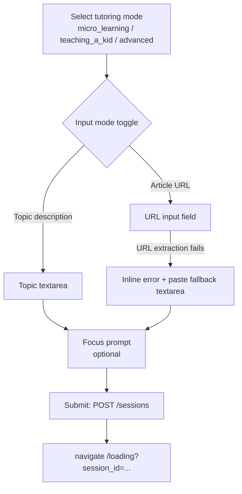
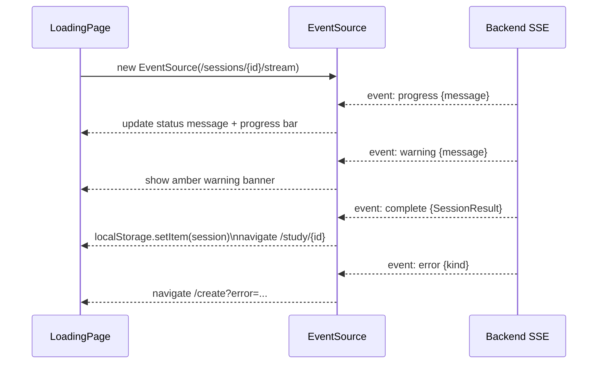
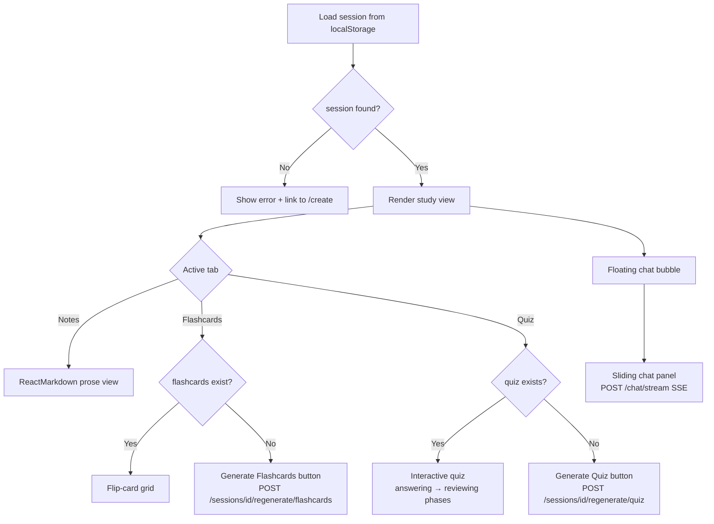
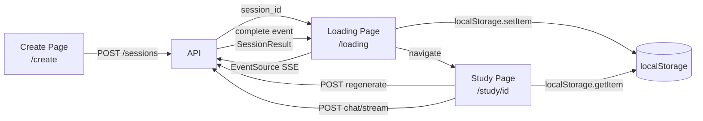

# Super Tutor — Frontend

Next.js 14 (App Router) frontend for Super Tutor. Provides the session creation form, a real-time SSE progress screen, and an interactive study view with notes, flashcards, quiz, and a grounded chat panel.

---

## Tech Stack

| Layer | Technology |
|-------|-----------|
| Framework | Next.js 14 (App Router) |
| Language | TypeScript |
| Styling | Tailwind CSS |
| Markdown rendering | react-markdown + remark-gfm |
| Session persistence | `localStorage` (client-side only) |
| Backend communication | `fetch` + native `EventSource` (SSE) |

---

## Directory Layout

```
frontend/src/
├── app/
│   ├── layout.tsx                    # Root layout (nav, global styles)
│   ├── page.tsx                      # Landing page — hero + feature cards + recent sessions
│   ├── create/
│   │   └── page.tsx                  # Session creation form
│   ├── loading/
│   │   └── page.tsx                  # SSE progress screen (EventSource consumer)
│   └── study/
│       └── [sessionId]/
│           └── page.tsx              # Study session view (notes / flashcards / quiz / chat)
├── hooks/
│   └── useRecentSessions.ts          # Recent sessions hook (localStorage-backed)
└── types/
    └── session.ts                    # Shared TypeScript types for all session data
```

---

## Pages

### Landing Page — `/`

**File:** `src/app/page.tsx`

- Displays a hero section with a CTA to `/create`
- Shows three tutoring mode feature cards
- Lists up to 5 recent sessions from `localStorage` (via `useRecentSessions`)

---

### Create Page — `/create`

**File:** `src/app/create/page.tsx`

The session creation form. Handles two input modes:



**Error recovery:** If a URL session fails (paywall, invalid URL, empty content), the user is redirected back to `/create` with `?error=<kind>` query params. The form restores their tutoring mode and focus prompt, and reveals a paste-text fallback input.

---

### Loading Page — `/loading`

**File:** `src/app/loading/page.tsx`

Connects to the backend SSE stream and shows real-time progress.



**Progress bar:** Advances through two weight steps (`[20%, 100%]`) as SSE `progress` events arrive, giving visual feedback even before the final `complete` event.

---

### Study Page — `/study/[sessionId]`

**File:** `src/app/study/[sessionId]/page.tsx`

The main study view, loaded entirely from `localStorage`. Three tabs + an optional chat panel.



#### Tabs

| Tab | Content | Generation |
|-----|---------|-----------|
| **Notes** | Markdown rendered with `react-markdown` | Generated during session creation |
| **Flashcards** | Flip-card grid (8–12 cards) | On-demand via `POST /sessions/{id}/regenerate/flashcards` |
| **Quiz** | Multiple-choice, question-by-question, then review | On-demand via `POST /sessions/{id}/regenerate/quiz` |

#### Chat Panel

- Floating button (bottom-right) toggles a slide-in panel
- Streams tokens from `POST /chat/stream` using `ReadableStream` + `TextDecoder`
- Chat history persisted to `localStorage` as `chat:{sessionId}`
- History is capped at 6 prior turns before sending to the backend (client-side cap)
- History is stateless — the full window is sent on every request

---

## Data Flow



**Why `localStorage`?**
Session data is stored client-side so the study page loads instantly without a round-trip. The backend only stores workflow session state and agent traces for observability — it does not serve session data back to the frontend.

---

## State Management

There is no global state library. State lives in:

| Store | Contents | TTL |
|-------|----------|-----|
| `localStorage: session:{id}` | Full `SessionResult` | Until cleared by browser / user |
| `localStorage: chat:{id}` | Chat history array | Until cleared by browser / user |
| `localStorage: super_tutor_recent_sessions` | Last 5 session stubs | Managed by `useRecentSessions` hook |
| React `useState` | UI-only state (active tab, quiz phase, chat open) | Page lifetime |

### useRecentSessions Hook

**File:** `src/app/hooks/useRecentSessions.ts`

Maintains a list of up to 5 recent session stubs. On each `saveSession()` call:
1. Deduplicates by `session_id`
2. Prepends the new entry
3. Evicts the oldest if `> 5` entries
4. Shows a toast notification when eviction occurs
5. Validates that the full session data still exists in `localStorage` before returning

---

## TypeScript Types

**File:** `src/types/session.ts`

Key types shared across all pages:

```typescript
type TutoringType = "micro_learning" | "teaching_a_kid" | "advanced";
type SessionType = "url" | "topic";

interface SessionResult {
  session_id: string;
  source_title: string;
  tutoring_type: TutoringType;
  session_type: SessionType;
  sources?: string[];        // Research sources for topic sessions
  notes: string;             // Markdown
  flashcards: Flashcard[];
  quiz: QuizQuestion[];
}

interface Flashcard { front: string; back: string; }
interface QuizQuestion { question: string; options: string[]; answer_index: number; }
```

SSE event types mirror the backend stream events: `ProgressEvent`, `CompleteEvent`, `ErrorEvent`, `WarningEvent`.

---

## Environment Variables

| Variable | Required | Description |
|----------|----------|-------------|
| `NEXT_PUBLIC_API_URL` | Yes | Base URL of the backend API, e.g. `http://localhost:8000` |

---

## Running Locally

```bash
cd frontend
npm install
echo "NEXT_PUBLIC_API_URL=http://localhost:8000" > .env.local
npm run dev
```

Open `http://localhost:3000`.

---

## Building for Production

```bash
npm run build
npm start
```
